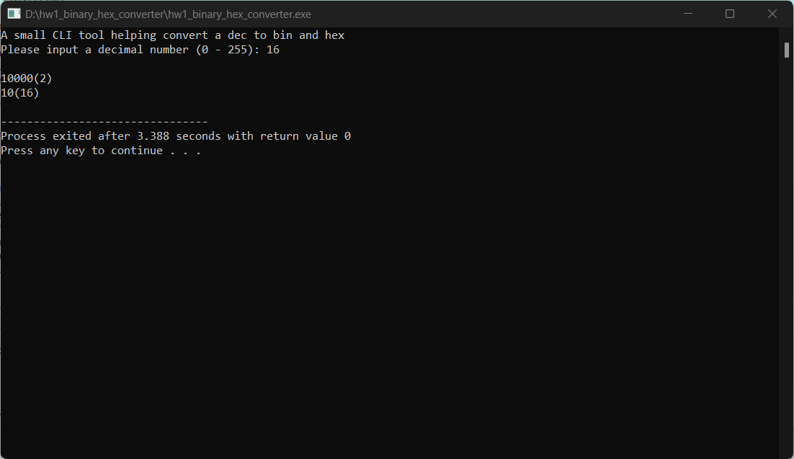

# hw1_binary_hex_converter
 
Hong-Ren, Huang (B507110048)

School of Public Health, Taipei Medical University

XB500070: Fundamental Data Structure & Algorithm

March 3, 2023

# Description

A cross-platform CLI tool to convert a decimal number to binary and hexadecimal numbers, respectively. The original problem required input in range 0 - 255; However, the method we adopt does not have this limitation. In this case, we only handle integer part.

# Principle

Simply put, to convert a number with base 10 to base 2 or 16, we divide the decimal integer by 2 (or 16) until the quotient is 0, and then take the remainder from bottom to top. [1]

We can break down the procedure into the steps below:

Step 1. Input a number `dec` (*n*) with base 10.

Step 2. Devide *n* by 2, calculating the remainder (*n*%2) and append it to the reversed array.

Step 3. set *n* to *n*/2 (quotient).

Step 4. Repeat steps 2 and 3 until the remainder is 0.

```c
// Steps 2, 3 and 4
int i = 0;
while (n > 0) {
    // storing remainder in binary array (reversed)
    bin_num_rev[i] = n % 2;
    n = n / 2;
    i++;
}
```

Step 5. "Reverse" the "reversed" array to correct order and print to terminal screen.

```c
// Step 5
for (int j = i - 1; j >= 0; j--)
    {
        cout << bin_num_rev[j];
    }
    cout << "(2)" << endl;
```

As for converting decimal number into hexadecimal number, substitute 2 mentioned above to 16 in the procedure. But we need to use string to present hexadecimal number, so we convert the digits to correspondent ASCII code.

```c
// convert the digits to correspondent ASCII code
if (rem < 10) {
    ch = rem + 48; // ASCII convertion for digits 0 - 10
}
else {
    ch = rem + 55; // ASCII convertion for digits A - F
}
```

# Results

Screenshot if input 16.



# References

[1] Digital System. http://www.chwa.com.tw/TResource/VS/book1/ch2/2-5.htm

[2] Program for Decimal to Binary Conversion. https://www.geeksforgeeks.org/program-decimal-binary-conversion/

[3] Program for Decimal to Hexadecimal Conversion https://www.geeksforgeeks.org/program-decimal-hexadecimal-conversion/